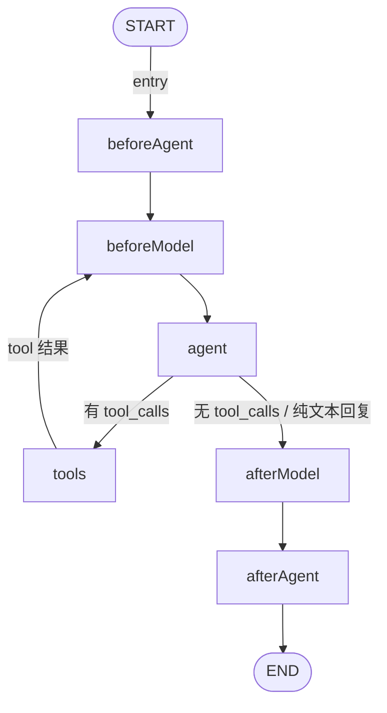
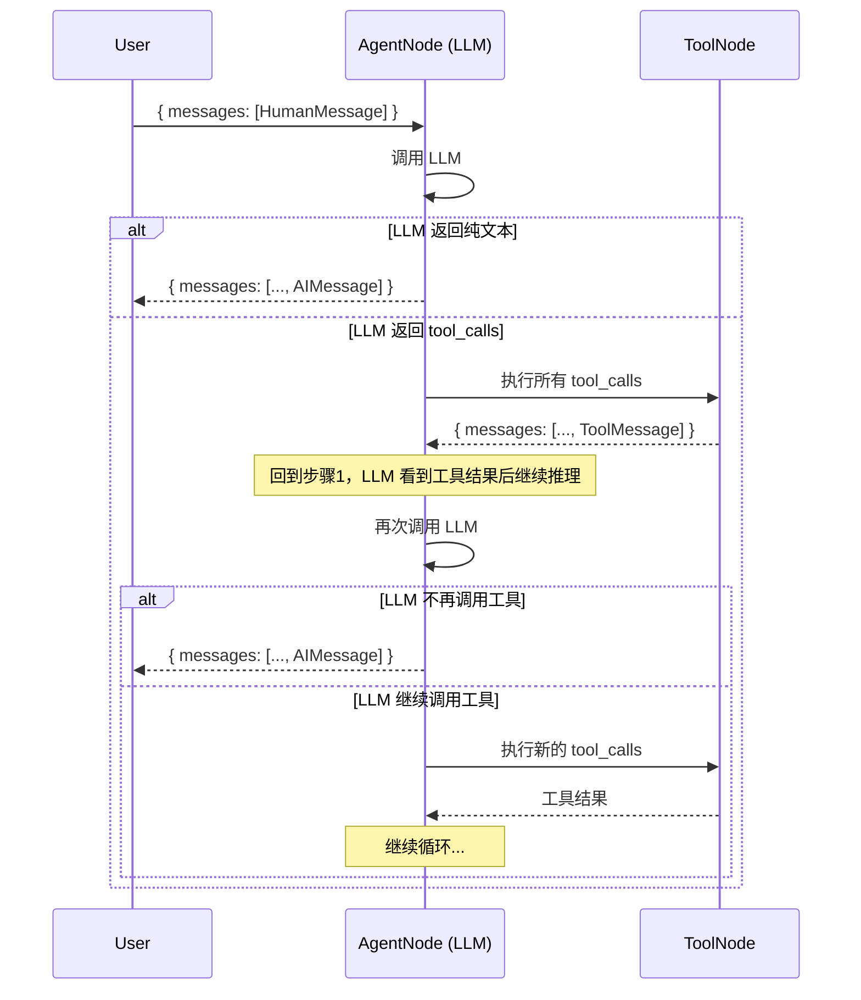
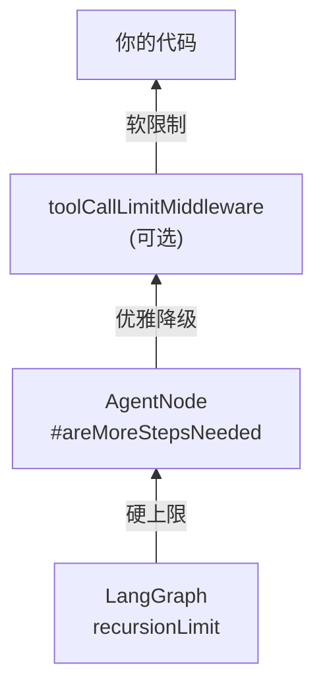
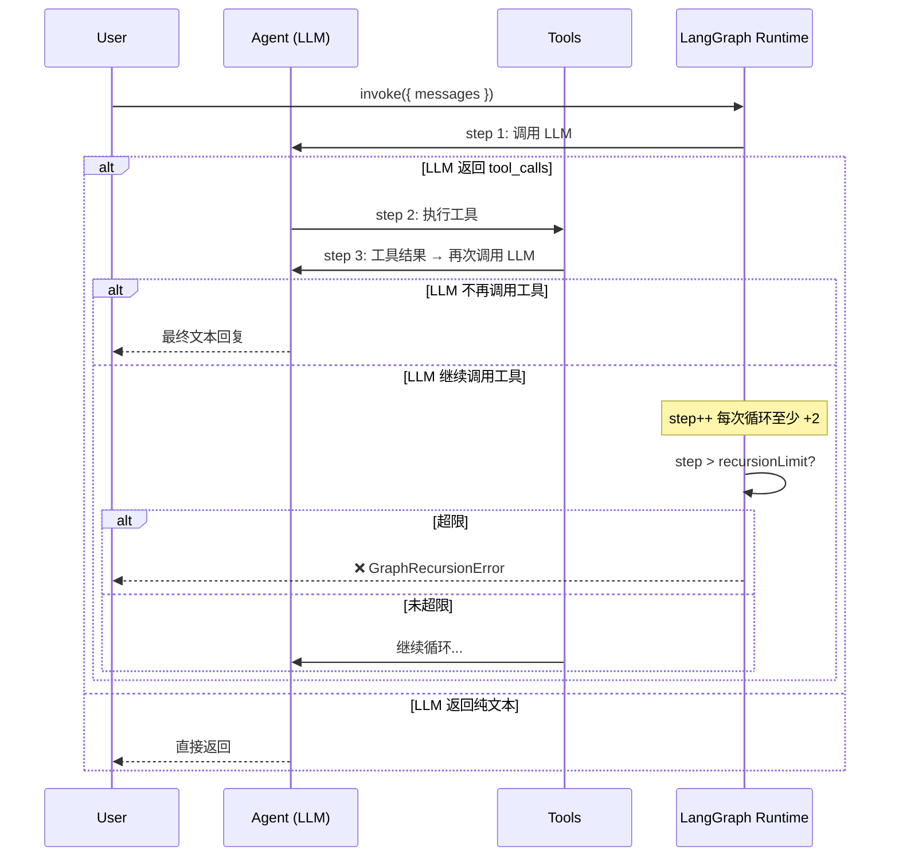
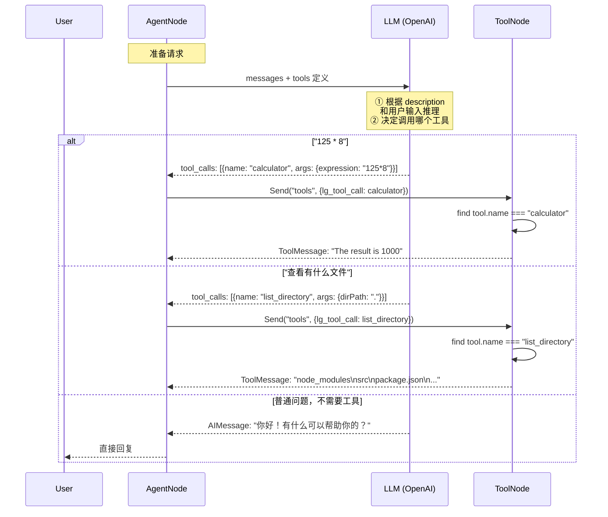
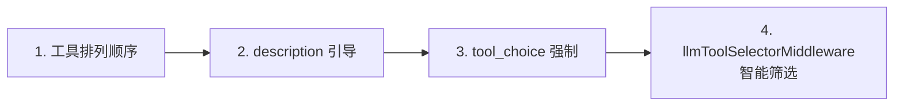
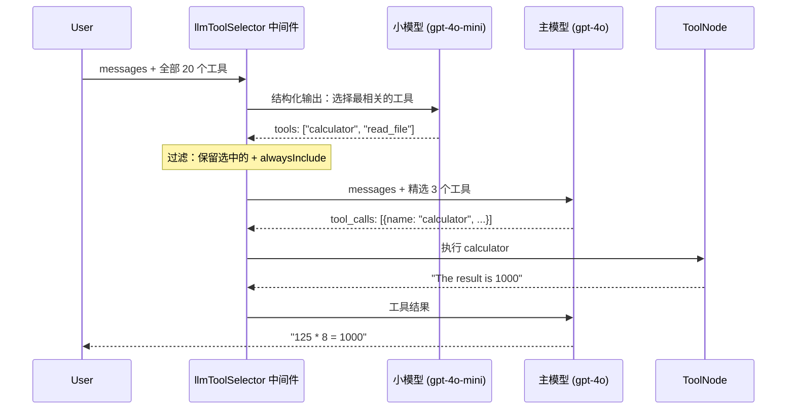
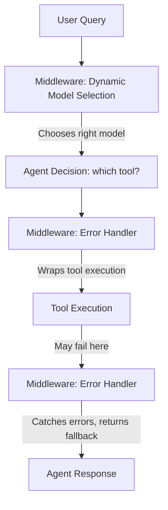
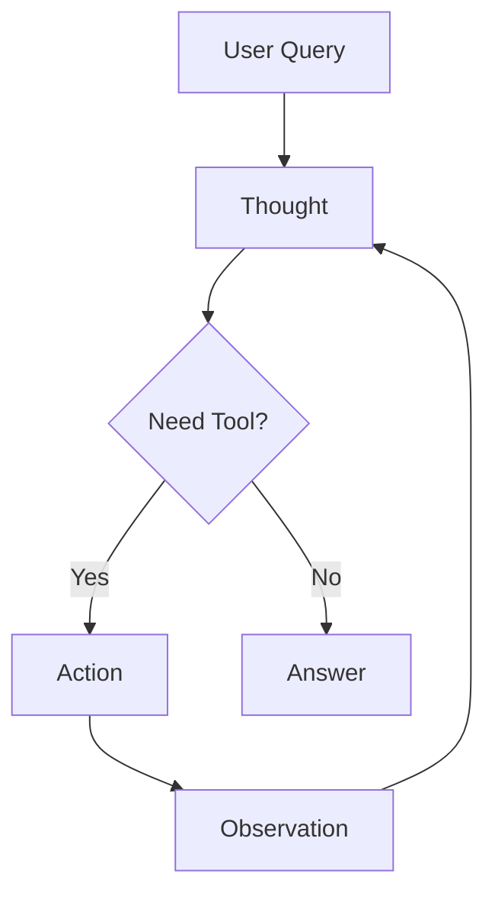

## 项目初始化

1. 使用`bun`创建一个空项目

```bash
bun init
```

2. 安装依赖

```bash
 pnpm  add zod langchain @langchain/openai @langchain/core
```
3. 创建环境变量 `.env`

```bash
OPENAI_API_KEY=
OPENAI_MODEL=
OPENAI_API_BASE_URL=
```
4. 校验环境变量
```ts
// types/env.ts
import { z } from "zod";

const envSchema = z.object({
  OPENAI_API_BASE_URL: z.url().min(1),
  OPENAI_API_KEY: z.string().min(1),
  OPENAI_MODEL: z.string().min(1),
});

// 解析环境变量
const parsedEnv = envSchema.safeParse(process.env);

if (!parsedEnv.success) {
  console.error(
    "❌ Invalid environment variables:",
    z.treeifyError(parsedEnv.error),
  );
  process.exit(1);
}

export const settings = {
  openai_api_base_url: parsedEnv.data.OPENAI_API_BASE_URL,
  openai_api_key: parsedEnv.data.OPENAI_API_KEY,
  openai_model: parsedEnv.data.OPENAI_MODEL,
};

```
在程序入口文件引入
```ts
// index.ts
import "./types/env.ts";  
```

## 模型抽象层ChatOpenAI

### ChatOpenAI的简单使用
[详细参数与方法](https://reference.langchain.com/javascript/langchain-openai/ChatOpenAI)
```ts
// src/chat.ts
export const chatOpenAI = new ChatOpenAI({
  model: settings.openai_model,
  apiKey: settings.openai_api_key,
  // 随机性和创造性 越接近0越保守
  temperature: 0.7,
  // 超时时间
  timeout: 60000,
  // 最大重试次数
  maxRetries: 3,
  // 最大令牌数
  maxTokens: 4096,
  // 配置
  configuration: {
    baseURL: settings.openai_api_base_url,
  },
});
export default async function main() {
  const result = await chatOpenAI.invoke("你好");
  console.log(result);
}
```
返回接口是一个AIMessage
[详细参数](https://reference.langchain.com/javascript/langchain/browser/AIMessage)
```json
AIMessage {
  "id": "chatcmpl-e6c0d8d7-6600-94c1-a857-a1a1bb56208d",
  "content": "你好！很高兴见到你。有什么我可以帮你的吗？",
  "additional_kwargs": {
    "reasoning_content": ""
  },
  "response_metadata": {
    "tokenUsage": {
      "promptTokens": 10,
      "completionTokens": 13,
      "totalTokens": 23
    },
    "finish_reason": "stop",
    "model_provider": "openai",
    "model_name": "kimi-k2.6"
  },
  "tool_calls": [],
  "invalid_tool_calls": [],
  "usage_metadata": {
    "output_tokens": 13,
    "input_tokens": 10,
    "total_tokens": 23,
    "input_token_details": {
      "cache_read": 0
    },
    "output_token_details": {}
  }
}
```


## Message


### SystemMessage vs HumanMessage vs AIMessage

它们都继承自 `BaseMessage`，核心区别在于 **角色定位** 和 **对模型行为的控制力**：

| | `SystemMessage` | `HumanMessage` |
|---|---|---|
| **角色** | 系统指令/设定 | 用户输入/提问 |
| **作用** | 定义 AI 的行为规则、人格、约束 | 提出具体问题或需求 |
| **谁说的** | 开发者（不是最终用户） | 最终用户 |
| **模型对待方式** | 视为不可违背的指令，优先级最高 | 视为需要回应的内容 |
| **典型位置** | 消息列表的开头，通常只有一条 | 紧随 SystemMessage 之后，可多条 |

结合代码来理解：

```ts
const messages = [
  // 1️⃣ SystemMessage：设定 AI 的"人设"和行为规则
  new SystemMessage(
    "你是一个代码助手，每次回答后，都需要提示用户，'该回答由AI产生，请仔细检查！'"
  ),
  // 2️⃣ HumanMessage：用户的实际提问
  new HumanMessage("列举一下ts中不经常用到的方法或者API"),
];
```

- **SystemMessage** 告诉模型："你是代码助手" + "每次回答后必须加免责提示"——这是**强约束**，模型会在整个对话中遵守。
- **HumanMessage** 是用户的具体问题，模型会据此生成回答内容。

简单类比——把模型想象成一个客服：

- `SystemMessage` = **公司给客服的培训手册**："你是技术客服，回答完必须说'仅供参考'"
- `HumanMessage` = **客户打来的电话**："TypeScript 有哪些冷门 API？"

客服会按照手册的规则来回答客户的问题，但手册本身不是客户看到的回答内容。

`AIMessage` 代表**模型的历史回复**。在多轮对话中，消息列表通常是这样的结构：

```ts
const messages = [
  new SystemMessage("你是一个代码助手..."),   // 系统设定
  new HumanMessage("第一个问题"),              // 第1轮 - 用户
  new AIMessage("第一个回答"),                 // 第1轮 - AI
  new HumanMessage("第二个问题"),              // 第2轮 - 用户
];
```

这样模型就能理解完整的对话上下文，实现多轮对话。

除了以上三种，LangChain 还提供了其他类型的消息，如 `FunctionMessage` 和 `ToolMessage`，用于处理函数调用和工具使用场景。

也支持字典模式`{ role: "system", content: "你是一个代码助手..." }`


### 聊天模式

1. 多回合对话

    聊天模型其实并不会记住之前的消息，需要在每次对话中传递完整的消息列表。

    

    [示例代码](https://github.com/cjy1998/agent-practice/blob/master/langchain/src/section2/multi-turn.ts)

2. 保持上下文
3. 流式输出
    [示例代码](https://github.com/cjy1998/agent-practice/blob/master/langchain/src/section2/streaming.ts)
4. 调整行为

### 流式输出深入理解

#### `process.stdout.write` 类型报错与语法说明

`chunk.content` 的类型定义是 `string | (ContentBlock | Text)[]`，TypeScript 不允许直接把可能是数组的值传给 `process.stdout.write()`。

修复方式：先做类型收窄，只写入字符串部分。

```ts
for await (const chunk of result) {
  const content = typeof chunk.content === "string" ? chunk.content : "";
  process.stdout.write(content);
}
```

`process.stdout.write(data)` 是 **Node.js / Bun 内置的进程 I/O API**，作用是把内容直接写入终端（标准输出），**不带换行符**。

| | `process.stdout.write()` | `console.log()` |
|---|---|---|
| **换行** | 不换行 | 自动加 `\n` |
| **性能** | 更底层，更快 | 内部调用 `.write()` + 格式化 |
| **适用场景** | 流式逐字输出、进度条 | 普通日志打印 |

在流式输出中，AI 的回复是一块一块（chunk）回来的。用 `process.stdout.write` 能实现**打字机效果**，所有 chunk 在同一行拼接显示；如果用 `console.log`，每一块都会换行。

#### `for await...of` 与异步迭代器

`for await...of` 是遍历**异步可迭代对象（AsyncIterable）**的语法。

```ts
const result = await model.stream(messages);
for await (const chunk of result) {
  process.stdout.write(content);
}
```

JavaScript 引擎会自动把它展开成类似这样的代码：

```ts
const iterator = result[Symbol.asyncIterator]();

while (true) {
  const { value, done } = await iterator.next();
  if (done) break;
  process.stdout.write(value.content);
}
```

`next()` 立即返回一个 **Promise**，不会阻塞主线程。但 Promise 内部的网络请求可能还没完成。**真正的"暂停"是 `await` 造成的**：

1. `await iterator.next()` 遇到 pending Promise，**把当前函数的执行权交还给事件循环**
2. 当模型服务端推送新的 chunk 过来，Promise resolve，`await` 恢复执行
3. 循环体执行完，再次 `await iterator.next()`，重复直到 `done: true`

| | 同步 `Symbol.iterator` | 异步 `Symbol.asyncIterator` |
|---|---|---|
| `next()` 返回 | `{ value, done }` | `Promise<{ value, done }>` |
| 数据等待 | 立即拿到，CPU 计算 | 需要 I/O（网络/文件） |
| 语法 | `for...of` | `for await...of` |
| 是否会"暂停" | 不会 | 会（`await` Promise） |

#### 流式输出时收集完整内容

可以边流边拼接到一个变量中，循环结束后就得到了完整回答：

```ts
let fullContent = "";

for await (const chunk of result) {
  const content = typeof chunk.content === "string" ? chunk.content : "";
  process.stdout.write(content); // 实时输出到终端
  fullContent += content;        // 同步拼接到完整字符串
}

console.log("\n--- 完整内容 ---");
console.log(fullContent);
```

两者不冲突：流式体验保留，完整内容也能拿到。常见用途包括做二次处理、计算 token 数、保存到数据库等。

### token使用追踪

#### usage收集的两种方式

1. 非流式
```ts
import { createModel } from "../utils/index";

export default async function trackTokenUsage() {
  const model = createModel({ modelName: "qwen3.7-max-2026-05-17" });
  const result = await model.invoke("TUI框架是什么？");
  const usage = result.usage_metadata;
  console.log(`\n 输入token: ${usage?.input_tokens}`);
  console.log(`\n 输出token: ${usage?.output_tokens}`);
  console.log(`\n 总token: ${usage?.total_tokens}`);
}
```

2. 流式
一般在最后一个chunk返回usage
```ts
import { createModel } from "../utils/index";
import { AIMessageChunk } from "@langchain/core/messages";

export default async function trackTokenUsage() {
  const model = createModel({ modelName: "qwen3.7-max-2026-05-17" });
  let finalChunk: AIMessageChunk | undefined;
  const result = await model.stream("TUI框架是什么？");
  for await (const chunk of result) {
    process.stdout.write(chunk.content as string);
    finalChunk = chunk;
  }
  const usage = finalChunk?.usage_metadata;
  console.log(`\n 输入token: ${usage?.input_tokens}`);
  console.log(`\n 输出token: ${usage?.output_tokens}`);
  console.log(`\n 总token: ${usage?.total_tokens}`);
}
```
#### 降低成本的简单方法

1. 使用`maxTokens`限制响应长度
2. 压缩对话记录
```ts
const recentMessages = messages.slice(-10);
const response = await model.invoke(recentMessages);
```
## Templates

### Messages vs Templates

```ts
  import { createModel } from "../utils/index";
  import { HumanMessage, SystemMessage } from "langchain";
  import { ChatPromptTemplate } from "@langchain/core/prompts";
  
  export default async function messagesVsTemplates() {
    const model = createModel();
    //messages
    const messages = [
      new SystemMessage("You are a helpful assistant."),
      new HumanMessage("把今天天气怎么样翻译成英文?"),
    ];
    const result = await model.invoke(messages);
    console.log(`messages result: ${result.content}`);
    // templates
    const template = ChatPromptTemplate.fromMessages([
      ["system", "You are a helpful translator."],
      ["human", "Translate '{text}' to {language}"],
    ]);
    const templateChain = template.pipe(model);
    const templateResult = await templateChain.invoke({
      text: "今天天气怎么样",
      language: "日语",
    });
    console.log(`template result: ${templateResult.content}`);
  }

```
| | `Messages` | `Templates` |
|---|---|---|
| **本质** | 手动拼接，硬编码 | 可复用的"模板函数" |
| **变量替换** | 不支持（字符串拼接 | 支持 `{变量名}` 插值 |
| **复用性** | 差，每次写一套 | 好，一次定义多处调用 |
| **适合场景** | Agent、动态工作流、多步推理、工具集成 | RAG、复用提示、变量替换、一致性 |
| **链式调用** | 不行 | 支持 `.pipe(model) |

### pip

.pipe()` 就像管道符 `|`，把前一个组件的输出作为后一个组件的输入。链一旦建好，你就把它当**一个整体**来调用，不需要手动处理中间转换。

```ts
const template = ChatPromptTemplate.fromMessages([
  ["system", "You are a helpful translator."],
  ["human", "Translate '{text}' to {language}"],
]);

// 用 .pipe() 把 template 和 model 串联成链
const templateChain = template.pipe(model);

```
现在 `templateChain` 是一个**统一的可调用对象**，可以直接 `.invoke()`：

```ts
const result = await templateChain.invoke({
  text: "今天天气怎么样",
  language: "英文",
});
```
为什么叫"可调用的链"？

`.pipe()` 返回的是 `Runnable` 对象，它有一套统一的调用接口：

| 方法 | 作用 |
|---|---|
| `.invoke(input)` | 单次调用 |
| `.stream(input)` | 流式输出 |
| `.batch(inputs)` | 批量调用 |
| `.pipe(next)` | 继续拼接下一个组件 |

链可以继续拼接

```ts
import { StringOutputParser } from "@langchain/core/output_parsers";

// template → model → outputParser
const templateChain = template
  .pipe(model)
  .pipe(new StringOutputParser()); // 把 AIMessage 转成纯字符串

const text = await templateChain.invoke({
  text: "你好",
  language: "英文",
});
console.log(text); // 纯字符串，不是 AIMessage 对象
```

### ChatPromptTemplate 与 PromptTemplate

两者的核心区别在于**输出格式**和**目标模型类型**：

| | `ChatPromptTemplate` | `PromptTemplate` |
|---|---|---|
| **输出类型** | `BaseMessage[]`（消息数组） | `string`（纯字符串） |
| **目标模型** | **聊天模型**（Chat Models）如 gpt-4, ChatOpenAI | **文本补全模型**（LLMs）如 text-davinci-003 |
| **能否设置 System 角色** | ✅ 可以，明确区分 system/human/ai | ❌ 不行，只有一个字符串模板 |
| **现代推荐度** | ⭐ **首选**，所有聊天场景都用它 | 仅用于特定旧模型或纯字符串场景

```ts
  import { createModel } from "../utils";
  import { PromptTemplate, ChatPromptTemplate } from "@langchain/core/prompts";
  export default async function TemplateFormat() {
    // ChatPromptTemplate
    const chatPrompt = ChatPromptTemplate.fromMessages([
      {
        role: "system",
        content: "你是一个以{style}风格并用{language}回答问题的{role}",
      },
      {
        role: "human",
        content: "{question}",
      },
    ]);
    const model = createModel();
    const result = await chatPrompt.pipe(model).invoke({
      role: "pirate",
      style: "dramatic",
      language: "中文",
      question: "什么是 TypeScript?",
    });
    console.log(result.content);
  
    console.log("\n2️⃣  PromptTemplate:\n");
    // PromptTemplate
    const stringTemplate = PromptTemplate.fromTemplate(
      "用{style}风格写一段{topic}的开头，用{language}回答",
    );
    const prompt = await stringTemplate.format({
      style: "幽默",
      language: "中文",
      topic: "今天周三",
    });
  
    console.log(prompt + "\n");
  
    const result2 = await model.invoke(prompt);
    console.log(result2.content);
  }

```
| | `.format()` | `.pipe(model).invoke()` |
|---|---|---|
| **做什么** | 仅渲染模板 | 渲染模板 + 调用模型 |
| **返回值** | `string` 或 `BaseMessage[]` | `AIMessage`（模型回复） |
| **消耗 Token** | ❌ 不消耗 | ✅ 消耗 |
| **灵活性** | 高，可以拿到 prompt 做其他事 | 低，直接出结果 |
| **代码量** | 需要再写一行 `model.invoke(prompt)` | 一步完成

什么时候用 `.format()`？

想**查看、调试或二次处理**生成的 prompt 时：

```ts
const prompt = await template.format({...});
console.log("实际发给模型的内容：", prompt); // 调试
await saveToDB(prompt);                      // 存日志
const result = await model.invoke(prompt);   // 再手动调用
```
### 结构化输出

#### 基本结构化输出

**用 z.object（） 来定义模式，用 [model].withStructuredOutput（） 来获取类型化、验证过的数据。**

```ts
  import { createModel } from "../utils/index";
  import { z } from "zod";
  export default async function main() {
    const model = createModel();
    const personSchema = z.object({
      //使用 .describe（） 来告诉 AI 每个字段代表什么
      name: z.string().describe("姓名"),
      age: z.number().describe("年龄"),
      email: z.string().email().describe("邮箱地址"),
    });
  
    const structuredModel = model.withStructuredOutput(personSchema, {
      strict: true,
      method: "functionCalling",
    });
    const structuredOutput = await structuredModel.invoke(
      "我的名字是张三，年龄28岁，邮箱是1258963@qq.com",
    );
  
    console.log(structuredOutput);
  }

```
#### 复杂结构化输出

[示例代码](https://github.com/cjy1998/agent-practice/blob/master/langchain/src/section2.2/zod-schemas.ts)

输出结果

```
✅ Extracted Company Data:

{
  name: 'Microsoft',
  founded: 1975,
  headquarters: { city: 'Redmond', country: 'Washington' },
  products: [ 'Windows', 'Office', 'Azure', 'Xbox' ],
  employeeCount: 220000,
  isPublic: true
}
```
#### withStructuredOutput` 的三个 method 详解

| | jsonSchema | functionCalling | jsonMode |
| --- | --- | --- | --- |
| API 参数 | `response_format` + `type: json_schema` | `tools` + `tool_choice` | `response_format` + `type: json_object` |
| 返回方式 | `content` 直接是 JSON | `tool_calls` 返回 | `content` 是 JSON |
| Schema 强制 | ✅ 严格 | ✅ 严格 | ❌ 不保证 |
| strict 模式 | ✅ 支持 | ✅ 支持 | ❌ 不支持 |
| 模型兼容性 | 仅 GPT-4o+ | 大多数兼容 API ✅ | 较广泛 |


## Tools
 ### 什么是 `Function Calling` ?
 `Function Calling` 是一种让模型调用函数的机制，通过定义函数的 `schema` 让模型知道何时以及如何调用函数。将大语言模型从单纯的文本生成器转变为行动协调中枢。模型不再局限于文本输出，而是能够触发真实世界的操作——例如查询天气、检索数据库、调用API等。


### 简单的工具调用

[示例代码](https://github.com/cjy1998/agent-practice/blob/master/langchain/src/section3/01-simple-tool.ts)

### 多工具调用

[示例代码](https://github.com/cjy1998/agent-practice/blob/master/langchain/src/section3/02-multiple-tools.ts)

**哪些因素会影响LLM选择工具？**

工具名称、工具描述、参数模式、用户的问题

## Agent

[示例代码](https://github.com/cjy1998/agent-practice/blob/master/langchain/src/section4/01-create-agent-basic.ts)

### createAgent() 底层到底做什么？

`createAgent` 就是 `new ReactAgent()`，而 `ReactAgent` 在构造函数中用 **LangGraph StateGraph** 构建了一个 ReAct 循环的状态机：

```js
// langchain/dist/agents/index.js
function createAgent(params) {
  return new ReactAgent(params);
}
```

整个流程可以用这张图概括：



#### 构造函数核心步骤

**1. 校验 & 合并工具**

```ts
// 校验必须提供 model
if (!options.model) throw new Error("`model` option is required");
// 检查 model 上是否已经 bindTools 了（不允许重复绑定）
validateLLMHasNoBoundTools(options.model);
// 合并用户传入的 tools + middleware 提供的 tools
const toolClasses = [...options.tools, ...middlewareTools];
```

**2. 创建 StateGraph（状态图）**

```ts
const { state, input, output } = createAgentState(...);
const graph = new StateGraph(state, { input, output, context });
```

这是 LangGraph 提供的有向图，每个节点是一个处理步骤，边决定流转方向。状态中最重要的字段是 `messages: BaseMessage[]`。

**3. 注册节点（Nodes）**

| 节点 | 类 | 作用 |
|---|---|---|
| `"agent"` | `AgentNode` | 调用 LLM，拿到 AI 回复（可能包含 tool_calls） |
| `"tools"` | `ToolNode` | 执行 tool_calls，返回 ToolMessage |
| `middleware名.before_agent` | `BeforeAgentNode` | 中间件：在 Agent 运行前执行 |
| `middleware名.before_model` | `BeforeModelNode` | 中间件：在 LLM 调用前执行 |
| `middleware名.after_model` | `AfterModelNode` | 中间件：在 LLM 调用后执行 |
| `middleware名.after_agent` | `AfterAgentNode` | 中间件：在 Agent 运行后执行 |

在没有 middleware 的场景下，只有 **`agent`** 和 **`tools`** 两个核心节点。

**4. 注册边（Edges）—— 循环的关键**

```ts
// START → agent（入口）
graph.addEdge(START, "agent");

// agent → 路由决定
graph.addConditionalEdges("agent", createModelRouter(), ["tools", END]);

// tools → agent（回到 LLM，形成循环）
graph.addEdge("tools", "agent");
```

核心路由逻辑在 `#createModelRouter` 中：

```ts
(state) => {
  const lastMessage = state.messages.at(-1);
  // 如果最后一条消息不是 AIMessage 或者没有 tool_calls → 结束
  if (!AIMessage.isInstance(lastMessage) || !lastMessage.tool_calls?.length)
    return END;
  // 否则 → 发送到 tools 节点并行执行
  return regularToolCalls.map(call => new Send("tools", { ...state, lg_tool_call: call }));
};
```

**5. 编译图**

```ts
this.#graph = graph.compile({
  checkpointer: options.checkpointer,
  store: options.store,
  name: options.name,
  transformers: [createToolCallTransformer([]), ...],
});
```

`compile()` 把 StateGraph 变成一个可执行的 `CompiledGraph`，支持 `invoke()` 和 `stream()`。

#### invoke() 执行流程

```ts
async invoke(state, config) {
  const mergedConfig = mergeConfigs(this.#defaultConfig, config);
  const initializedState = await this.#initializeMiddlewareStates(state, mergedConfig);
  return this.#graph.invoke(initializedState, mergedConfig);
}
```

本质上就是把状态丢进编译好的 LangGraph 图中执行。图中的循环如下：



#### 对比手动写法

在 `02-multiple-tools.ts` 中的手动写法：

```ts
// 手动：1. 绑定工具
const boundModel = model.bindTools(tools);
// 手动：2. 调用模型
const result = await boundModel.invoke(messages);
// 手动：3. 处理 tool_calls
for (const toolCall of result.tool_calls) {
  const toolResult = await toolCallHandler(tools, toolCall);
  // 手动：4. 拼装 ToolMessage
  baseMessage.push(new ToolMessage({ content: toolResult, tool_call_id: toolCall.id }));
  // 手动：5. 再次调用模型
  const finalResult = await boundModel.invoke(baseMessage);
}
```

`createAgent()` 把步骤 2-5 **全部自动化**到一个 LangGraph 状态机中：LLM 调用 → 检查 tool_calls → 执行工具 → 把结果喂回 LLM → 循环，直到 LLM 不再请求工具调用为止。

---

[示例代码](https://github.com/cjy1998/agent-practice/blob/master/langchain/src/section4/02-create-agent-multi-tool.ts)

### createAgent() 如何防止无限循环？

`createAgent()` (即 `ReactAgent`) 防止无限循环的机制有 **三层**，由底层到高层分别是：



#### 第 1 层：LangGraph 的 `recursionLimit`（硬上限）

这是最根本的安全网。`ReactAgent` 底层是一个 LangGraph StateGraph，而 LangGraph 的执行引擎（PregelLoop）在每次 tick 时检测 step 是否超限：

```js
// @langchain/langgraph/dist/pregel/loop.js
const stop = step + (config.recursionLimit ?? DEFAULT_LOOP_LIMIT) + 1;

// tick() 内
if (this.step > this.stop) {
    this.status = "out_of_steps";
    return false;
}
```

超限后抛出 `GraphRecursionError`：

```js
// @langchain/langgraph/dist/pregel/index.js
if (loop.status === "out_of_steps") throw new GraphRecursionError([
    `Recursion limit of ${config.recursionLimit} reached`,
    "without hitting a stop condition. You can increase the",
    `limit by setting the "recursionLimit" config key.`
].join(" "), { lc_error_code: "GRAPH_RECURSION_LIMIT" });
```

**默认值是 25**：

```js
// @langchain/langgraph/dist/pregel/utils/config.js
const DEFAULT_RECURSION_LIMIT = 25;
```

可以通过 `withConfig` 修改：

```ts
const agent = createAgent({ model, tools: commonTools });
const result = await agent.invoke(
  { messages: [new HumanMessage(query)] },
  { recursionLimit: 50 }  // 将递归限制调为 50
);
```

#### 第 2 层：AgentNode 内部的 `#areMoreStepsNeeded`（优雅降级）

在到达硬上限之前，如果状态中存在 `remainingSteps` 字段，AgentNode 会提前拦截并返回一条礼貌消息而非报错：

```js
// AgentNode.js
#areMoreStepsNeeded(state, response) {
    const allToolsReturnDirect = AIMessage.isInstance(response)
        && response.tool_calls?.every(call => this.#options.shouldReturnDirect.has(call.name));
    const remainingSteps = "remainingSteps" in state ? state.remainingSteps : undefined;
    return Boolean(
        remainingSteps &&
        (remainingSteps < 1 && allToolsReturnDirect ||
         remainingSteps < 2 && hasToolCalls(state.messages.at(-1)))
    );
}
```

当步数快耗尽时，`AgentNode.#run()` 返回替代消息：

```js
if (this.#areMoreStepsNeeded(state, aiMessage)) {
    commands.push(new Command({
        update: { messages: [new AIMessage({
            content: "Sorry, need more steps to process this request.",
            name: this.name,
            id: aiMessage.id
        })] }
    }));
}
```

> **注意**：在基本用法中（没有 checkpointer 管理状态），`remainingSteps` 通常不会出现在状态中，所以这个检查不会生效。它主要是为使用 LangGraph checkpointer 的场景设计的。

#### 第 3 层：`toolCallLimitMiddleware`（可选的细粒度限制）

这是可以主动加入的中间件，提供更精细的控制：

```ts
import { createAgent, toolCallLimitMiddleware, HumanMessage } from "langchain";

const agent = createAgent({
  model,
  tools: commonTools,
  middleware: [
    toolCallLimitMiddleware({
      runLimit: 10,        // 单次运行最多 10 次工具调用
      threadLimit: 50,     // 整个线程最多 50 次工具调用
      exitBehavior: "continue",  // "continue" | "error" | "end"
    }),
  ],
});
```

它通过 `afterModel` 钩子在 LLM 返回 tool_calls 之后、工具执行之前进行拦截，三种退出行为：

| `exitBehavior` | 行为 |
|---|---|
| `"continue"` | （默认）超限的工具调用被替换为错误 ToolMessage，其他工具继续执行，LLM 看到错误后自行决定是否停止 |
| `"error"` | 直接抛出 `ToolCallLimitExceededError` 异常 |
| `"end"` | 立即注入错误 ToolMessage + 最终 AIMessage，然后跳转到 `END` 终止图 |

#### 循环如何自然终止？

即使不设限，ReAct 循环也不会无限运行，因为 LLM 认为问题已经解决时会返回纯文本回复（无 `tool_calls`），路由器返回 `END`：

```js
// #createModelRouter
(state) => {
    const lastMessage = state.messages.at(-1);
    if (!AIMessage.isInstance(lastMessage) ||
        !lastMessage.tool_calls || lastMessage.tool_calls.length === 0)
        return exitNode;  // → END
    // 有工具调用 → tools 节点
    return regularToolCalls.map(...);
};
```

完整循环示意：



#### 总结

| 层级 | 机制 | 默认值 | 行为 |
|---|---|---|---|
| **LangGraph 硬上限** | `recursionLimit` | 25 步 | 超限抛 `GraphRecursionError` |
| **AgentNode 优雅降级** | `remainingSteps` 检查 | undefined（不启用） | 步数不足时返回 "Sorry" 消息 |
| **toolCallLimitMiddleware** | 工具调用计数 | 需手动添加 | 可选 continue / error / end |

---

### Agent 如何决定使用哪个工具？

这不是 Agent 代码决定的，而是 **LLM（大语言模型）** 决定的。整条链路如下：

#### 第 1 步：工具定义 → JSON Schema

当传入 `tools: commonTools`，`ReactAgent` 在构造函数中收集所有工具：

```ts
const toolClasses = [...options.tools, ...middlewareTools];
```

然后在 `AgentNode.#invokeModel` 中，每次调用 LLM 前通过 `#bindTools` 将工具绑定到模型：

```ts
const modelWithTools = await this.#bindTools(request.model, request, structuredResponseFormat);
```

`#bindTools` 内部调用 `ChatOpenAI.bindTools()`，最终通过 `convertToOpenAIFunction` 将每个工具转为 OpenAI API 格式：

```ts
// @langchain/core/dist/utils/function_calling.js
function convertToOpenAIFunction(tool, fields) {
  return {
    name: tool.name,            // 工具名
    description: tool.description,  // 工具描述
    parameters: toJsonSchema(tool.schema),  // zod → JSON Schema
  };
}
```

以 `commonTools` 为例，最终发给 API 的是类似这样的 JSON：

```json
{
  "tools": [
    {
      "type": "function",
      "function": {
        "name": "calculator",
        "description": "Useful for performing mathematical calculations. Use this when you need to compute numbers.",
        "parameters": {
          "type": "object",
          "properties": {
            "expression": {
              "type": "string",
              "description": "The mathematical expression to evaluate, e.g. '25 * 4'"
            }
          },
          "required": ["expression"]
        }
      }
    },
    {
      "type": "function",
      "function": {
        "name": "read_file",
        "description": "Reads the content of a file from the filesystem...",
        "parameters": {
          "type": "object",
          "properties": {
            "filePath": { "type": "string", "description": "The path to the file to read..." }
          },
          "required": ["filePath"]
        }
      }
    }
  ]
}
```

#### 第 2 步：LLM 做出选择

LLM 收到工具定义 + 用户消息后，**自己决定**是否调用工具、调用哪个、传什么参数。这是语言模型内置的 Function Calling 能力，不是代码逻辑。

| 用户输入 | LLM 推理过程 | LLM 的 tool_call 响应 |
|---|---|---|
| `"What is 125*8?"` | 包含数学计算，calculator 的 description 匹配 | `{name: "calculator", args: {expression: "125*8"}}` |
| `"查看一下有什么文件"` | 需要浏览目录，list_directory 的 description 匹配 | `{name: "list_directory", args: {dirPath: "."}}` |

#### 第 3 步：路由 → 执行 → 回传



#### 影响工具选择的四个因素

| 因素 | 代码中对应 | 作用 |
|---|---|---|
| **工具名称** `name` | `name: "calculator"` | LLM 通过名称做语义匹配 |
| **工具描述** `description` | `"Useful for performing mathematical calculations..."` | **最关键的因素**，LLM 以此判断何时使用该工具 |
| **参数模式** `schema` | `z.object({ expression: z.string().describe(...) })` | 帮助 LLM 理解需要传什么参数 |
| **用户输入** | `HumanMessage` 的 content | LLM 综合理解用户意图后匹配最合适的工具 |

> **为什么 `description` 最关键？** LLM 无法看到工具的实现代码，它唯一的依据就是 `name` + `description` + `schema`。如果发现 LLM 经常选错工具，优先改进 `description`。

---

### 可以优先选择某些工具吗？

可以，有 **4 种机制**，从简单到高级：



#### 方法 1：工具数组顺序（隐式优先级）

OpenAI API 文档指出：**排在 `tools` 数组前面的工具，LLM 会略微偏向选择**：

```ts
const agent = createAgent({
  model,
  // calculator 排在前面，LLM 会略微偏向它
  tools: [calculatorTool, readFileTool, writeFileTool, listDirTool],
});
```

> ⚠️ 效果微弱，只是"倾向"而非"保证"。当工具描述明显指向不同场景时（如计算器 vs 文件操作），顺序影响很小。

#### 方法 2：优化 `description`（最实用）

**这是影响 LLM 选工具的核心因素。** LLM 根本看不到工具的实现代码，只能看到 `name`、`description`、`schema` 三个字段。精准的 description 就是指令：

```ts
// ❌ 模糊描述
export const calculatorTool = tool(
  async (input) => { /* ... */ },
  {
    name: "calculator",
    description: "Useful for calculations.",
    schema: z.object({ /* ... */ }),
  },
);

// ✅ 精确描述
export const calculatorTool = tool(
  async (input) => { /* ... */ },
  {
    name: "calculator",
    description: "首选工具。当用户的问题涉及数学计算时，使用此工具而不是其他工具。",
    schema: z.object({ /* ... */ }),
  },
);

// ✅ 明确排除
export const readFileTool = tool(
  async (input) => { /* ... */ },
  {
    name: "read_file",
    description: "仅用于读取文件内容。不要用于数学计算。",
    schema: z.object({ /* ... */ }),
  },
);
```

#### 方法 3：`tool_choice` 强制选择

OpenAI API 的 `tool_choice` 参数可以强制 LLM 必须调用某个工具：

```ts
const model = createModel();

// 强制必须调用 calculator
const boundModel = model.bindTools([calculatorTool], {
  tool_choice: { type: "function", function: { name: "calculator" } },
});

// 强制必须调用某个工具（任意一个）
const boundModel = model.bindTools(commonTools, {
  tool_choice: "required",  // 或 "any"
});

// 自动选择（默认行为）
const boundModel = model.bindTools(commonTools, {
  tool_choice: "auto",
});
```

| `tool_choice` 值 | 含义 |
|---|---|
| `"auto"` | （默认）LLM 自行决定是否调用工具、调用哪个 |
| `"required"` / `"any"` | 必须调用至少一个工具，LLM 自己选哪个 |
| `{ type: "function", function: { name: "xxx" } }` | **强制**调用指定工具 |

#### 方法 4：`llmToolSelectorMiddleware`（智能筛选）

这是 LangChain Agent 内置的中间件，**当工具很多时最有用**。原理：**先用一个小模型筛选出最相关的 N 个工具，然后再把精选的工具列表传给主模型。**

```ts
import { createAgent, HumanMessage, llmToolSelectorMiddleware } from "langchain";

const agent = createAgent({
  model,
  tools: commonTools,  // 20+ 个工具
  middleware: [
    llmToolSelectorMiddleware({
      model: "openai:gpt-4o-mini",  // 用便宜的小模型做筛选
      maxTools: 3,                  // 最多选 3 个工具给主模型
      alwaysInclude: ["calculator"],  // calculator 永远包含，不占名额
    }),
  ],
});
```

**参数详解：**

| 参数 | 作用 |
|---|---|
| `model` | 用于筛选的小模型，不填则用 agent 的主模型 |
| `maxTools` | 最多传给主模型的工具数量 |
| `alwaysInclude` | 始终包含的工具名列表，不受 `maxTools` 限制 |
| `systemPrompt` | 自定义筛选指令，默认 `"Your goal is to select the most relevant tools..."` |

**执行流程：**



#### 总结对比

| 方法 | 优先级强度 | 适用场景 | 缺点 |
|---|---|---|---|
| **工具排列顺序** | ⭐ 很弱 | 差别不大时微调 | 基本没有实际效果 |
| **优化 description** | ⭐⭐ 中等 | 所有场景 | 需要人工精心编写 |
| **`tool_choice`** | ⭐⭐⭐ 很强 | 已知必须调用某工具 | 灵活性差，只能手动写死 |
| **`llmToolSelectorMiddleware`** | ⭐⭐ 智能筛选 | 工具数量多（10+）时 | 多一次小模型调用，有额外成本 |

**推荐优先级**：优先写好 `description` → 工具多时加 `llmToolSelectorMiddleware` → 需要强制时用 `tool_choice`。

## Middleware

[示例代码](https://github.com/cjy1998/agent-practice/blob/master/langchain/src/section4/03-agent-with-middleware.ts)

1. **wrapModelCall**：拦截对模型的调用

    主要用途：
    - 动态选择模型
    - 请求日志与监控
    - 上下文注入（用户权限、回话数据）
2. **wrapToolCall**：拦截工具执行
 
    主要用途：
    - 错误处理与重试
    - 工具结果转换
    - 工具执行前的权限检查

### 执行流程



### 内置中间件

[示例代码](https://github.com/cjy1998/agent-practice/blob/master/langchain/src/section4/04-built-in-middleware.ts)

1. **summarizationMiddleware**：总结长对话，使其保持在上下文范围内

## ReAct模式


