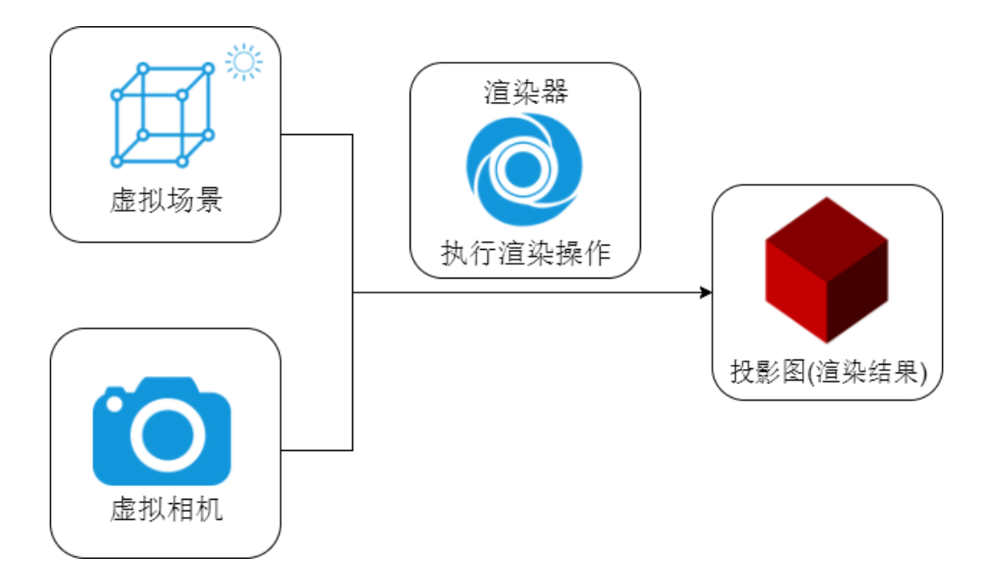

# Threejs
## 1.引入
### 1.1开发环境引入
```js
 npm i three@版本号 --save
```
```js
import * as THREE from 'three'
```
### 1.2引入拓展库

除了three.js核心库以外，在threejs文件包中examples/jsm目录下有各种不同功能的扩展库。
```js
// 引入扩展库OrbitControls.js
import { OrbitControls } from 'three/addons/controls/OrbitControls.js';
// 引入扩展库GLTFLoader.js
import { GLTFLoader } from 'three/addons/loaders/GLTFLoader.js';

```
```js
// 扩展库引入——旧版本，比如122, 新版本路径addons替换了examples/jsm
import { OrbitControls } from 'three/examples/jsm/controls/OrbitControls.js';

```
### 1.2学习环境引入
#### 1.2.1 script标签引入
```js
 <script src="./build/three.js"></script>
```
#### 1.2.2 ES6 import方式引入
```js
    <script type="module">
        // 现在浏览器支持ES6语法，自然包括import方式引入js文件
        import * as THREE from './build/three.module.js';
    </script>
```
#### 1.2.3 `type='importmap'`配置路径后引入
```js
   <!-- 具体路径配置，你根据自己文件目录设置 -->
    <script type="importmap">
        {
            "imports": {
                "three": "../../../three.js/build/three.module.js",
                //拓展库引入
                 "three/addons/": "./three.js/examples/jsm/"
            }
        }
    </script>
```
```js
    <!-- 配置type="importmap",.html文件也能和项目开发环境一样方式引入threejs -->
    <script type="module">
        import * as THREE from 'three';
        // 浏览器控制台测试，是否引入成功
        console.log(THREE.Scene);
    </script>
```
## 2. 基本概念

认识场景Scene、相机Camera、渲染器Renderer三个基本概念。


### 2.1 场景`Scene`
场景是所有物体、光源、辅助器等对象的容器，相当于一个空间，所有物体、光源、辅助器等对象都需要添加到场景中，才能进行渲染。
```js
const scene = new THREE.Scene();
```
**几何体**
| 几何体      | 说明 | 
| :---      |    :----:   |  
| 长方体    | BoxGeometry     | 
| 圆柱体    | CylinderGeometry      | 
| 球体      | SphereGeometry | 
| 圆锥      | ConeGeometry | 
| 矩形平面  | PlaneGeometry | 
| 圆平面 | CircleGeometry | 

文档搜索关键词`geometry`你可以看到threejs提供各种几何体相关API
### 2.2 相机`Camera`
相机决定了渲染什么以及如何渲染，场景中的物体只有被相机看到才会被渲染到页面上。Threejs中有多种相机，这里我们使用透视相机PerspectiveCamera。
```js

const camera = new THREE.PerspectiveCamera(75, window.innerWidth / window.innerHeight, 0.1, 1000);

```