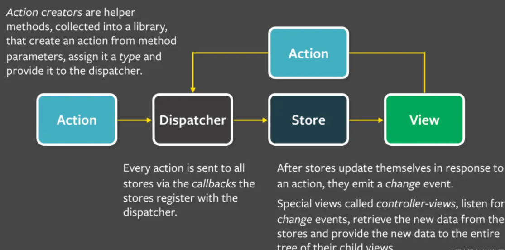
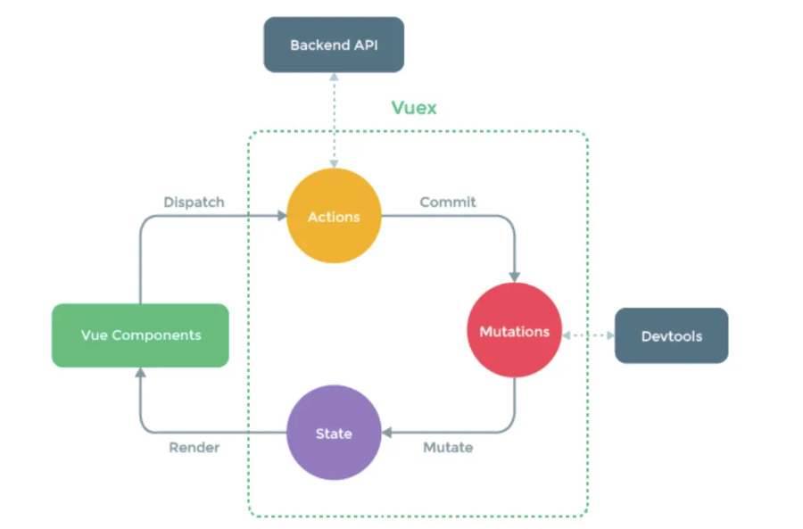

# Vue

## Vue2和Vue3有什么区别？
1. 性能优化
   - Vue3引入了新的虚拟DOM算法，使得更新性能得到显著的提升。
   - 静态提升：对不会变化的静态节点进行提升，减少创建和销毁的开销。
   - 事件缓存：对事件处理函数进行缓存，提高性能。
2. 响应式系统
   - Vue3使用了proxy代替Vue2中的`Object.defineProperty`来实现响应式，能够更好的处理嵌套对象和数组的新增、删除操作。
3. 组合式API（composition API）
   - Vue3新增了setup函数，支持使用组合式API来组织代码，提高逻辑复用性和代码的可读性。
4. 模板语法
   - 在Vue3的模板中，可以使用多个根节点。
5. 类型支持
   - Vue 3 在 `TypeScript` 类型推导方面有更好的支持。
6. 体积
   - Vue 3 进行了更细粒度的模块拆分，使得最终打包体积更小。
7. 生命周期
   - 一些生命周期钩子函数名称发生了变化，例如 `beforeCreate` 和 `created` 合并为 `setup` 。 
## Vue2和Vue3双向数据绑定的原理？
**Vue2**

Vue2采用的是基于`Object.defineProperty`的响应式系统，主要包括以下几个步骤：
1. **初始化数据：** Vue在实例化时会遍历data对象的属性，使用`Object.defineProperty`将这些属性转化为getter和setter。
2. **依赖收集：** 当一个属性被访问时（即调用getter），Vue会记录当前的依赖（如组件的渲染函数）。这些依赖会被添加到一个称为“依赖收集器”的数据结构中。
3. **变化检测：** 当属性发生变化时（即调用setter）,Vue会通知所有依赖这个属性的地方（如组件），从而触发重新渲染。

这种方式的缺点在于对数组和对象的某些变动操作（如通过索引直接修改数组元素）不太友好，需要 Vue 提供的特殊方法（如 Vue.set）来确保响应式。

**Vue3**

Vue3采用了基于`Proxy`的响应式系统，主要包括以下几个步骤：
1. **初始化数据：** Vue在实例化时会使用`Proxy`来代理data对象，从而拦截对data对象的操作。`Proxy` 能够直接监听对象上的操作（如读、写、删除属性），不再需要单独定义 getter 和 setter。
2. **依赖收集：** 与 Vue2 类似，Vue3 也会在属性被访问时进行依赖收集。但由于 Proxy 能够拦截所有操作，因此 Vue3 可以更加灵活和高效地管理依赖。
3. **变化检测：** 当属性发生变化时，Proxy 能够直接捕获这个变化，并通知相关依赖，从而触发重新渲染。

## 说说 SPA 单页面的理解，它的优缺点分别是什么？

SPA（single-page application）仅在 web 页面初始化加载相应的 HTML、JavaScript 和 Css。一旦页面加载完成，SPA 不会因为用户的操作而进行页面的重新加载或跳转；取而代之的是利用路由机制实现 HTML 内容的变换，UI 与用户的交互，避免页面重新加载。

### 优点

1. 用户体验好、快，内容的改变不需要重新加载整个页面，避免了不必要的跳转和重复渲染；
2. 基于上面一点，SPA 相对对服务器的压力小；
3. 前后端职责分离，架构清晰，前端进行交互逻辑，后端负责数据处理；

### 缺点

1. 初次加载耗时多：为实现单页 Web 应用功能及显示效果，需要在加载页面的时候将 JavaScript、CSS 统一加载，部分页面可能因网页结构复杂，加载出现延迟，影响用户体验。
2. SEO 难度较大：由于所有的内容都在一个页面中动态替换显示，所以在 SEO 上其有着天然的弱势。
3. 前进后退路由管理：由于单页应用在一个页面中显示所有的内容，所以不能使用浏览器的前进后退功能，所有的页面切换需要自己建立堆栈管理。

## v-if 和 v-show 的区别

1. v-if 是“真正”的条件渲染，因为它会确保在切换过程中条件块内的事件监听器和子组件适当地被销毁和重建。
2. v-if 也是惰性的：如果在初始渲染时条件为假，则什么也不做——直到条件第一次变为真时，才会开始渲染条件块。
3. v-show 不管初始条件是什么，元素总是会被渲染，并且只是简单地基于 CSS 的 display 属性进行切换。
4. v-if 和 v-for 的优先级，vue2 中 v-for 的优先级比 v-if 高，vue3 中 v-if 的优先级比 v-for 高。

## class 和 style 如何动态绑定？

在 vue 中，可以使用对象语法或数组语法来动态地绑定 class 或 style。

### 对象语法

对象语法的语法是：{key: value}，其中 key 是类名，value 是布尔值，当 value 为 true 时，该类名会被添加到元素上，当 value 为 false 时，该类名会被移除。

```html
<div v-bind:class="{ active: isActive }"></div>
```

### 数组语法

数组语法的语法是：[value1, value2, ...]，其中 value 可以是字符串、对象或数组，当 value 为字符串时，该字符串会被添加到元素上，当 value 为对象时，对象的 key 是类名，value 是布尔值，当 value 为 true 时，该类名会被添加到元素上，当 value 为 false 时，该类名会被移除，当 value 为数组时，数组的元素会被添加到元素上。

```html
<div v-bind:class="[activeClass, errorClass]"></div>
```

### 绑定内联样式

在 vue 中，可以使用对象语法或数组语法来动态地绑定内联样式。

### 对象语法

对象语法的语法是：{key: value}，其中 key 是样式名，value 是样式值。

```html
<div v-bind:style="{ color: activeColor, fontSize: fontSize + 'px' }"></div>
```

### 数组语法

数组语法的语法是：[value1, value2, ...]，其中 value 可以是字符串、对象或数组，当 value 为字符串时，该字符串会被添加到元素上，当 value 为对象时，对象的 key 是样式名，value 是样式值，当 value 为数组时，数组的元素会被添加到元素上。

```html
<div v-bind:style="[baseStyles, overridingStyles]"></div>
```

## 怎么理解 Vue 的单项数据流？

在 Vue 中，数据流是单向的，即从父组件到子组件。父组件可以通过 props 向子组件传递数据，子组件可以通过事件向父组件发送消息。这种单向数据流使得组件之间的通信更加清晰和可预测。

## computed 和 watch 的区别

**computed**：支持缓存，不支持异步，依赖于其他属性，只有它依赖的属性值发生发生改变，下一次获取 computed 的值时才会重新计算 computed 的值。

**watch**
不支持缓存，支持异步，监听的函数接收两个参数，第一个参数是最新的值，第二个参数是输入之前的值。

- immediate：组件加载立即触发回调函数
- deep：深度监听，发现数据内部的变化，在复杂数据类型中使用，例如数组中的对象发生变化。需要注意的是，deep 无法监听到数组和对象内部的变化。

## Vue2 和 Vue3 生命周期的区别

组合式 API 是没有 beforeCreate 和 created 这两个生命周期的，setup 去代替。
| 选项式 api | 组合式 api | 说明 |
| :--- | :----: | :---- |  
| beforeCreate | Not | 在实例初始化完成并且 props 被解析后立即调用,data() 和 computed 等选项也开始进行处理。 |
| created | Not | 当这个钩子被调用时，以下内容已经设置完成：响应式数据、计算属性、方法和侦听器。然而，此时挂载阶段还未开始，因此 $el 属性仍不可用。 |
| beforeMount | onBeforeMount | 组件已经完成了其响应式状态的设置，但还没有创建 DOM 节点。它即将首次执行 DOM 渲染过程。 |
| mounted | onMounted | 在组件挂载完成后执行，允许直接`DOM`访问 |
| beforeUpdate | onBeforeUpdate| 数据更新时调用，发生在虚拟 `DOM` 打补丁之前 |
| updated | onUpdated | `DOM`更新后，`updated`的方法即会调用。 |
| beforeUnmount| onBeforeUnmount| 在卸载组件实例之前调用。在这个阶段，实例仍然是完全正常的。 |
| unmounted | onUnmounted | 卸载组件实例后调用。调用此钩子时，组件实例的所有指令都被解除绑定，所有事件侦听器都被移除，所有子组件实例被卸载。 |
| errorCaptured | onErrorCaptured | 捕获了后代组件传递的错误时调用 |
| renderTracked | onRenderTracked | 注册一个调试钩子，当组件渲染过程中追踪到响应式依赖时调用。 |
| renderTriggered| onRenderTriggered | 注册一个调试钩子，当响应式依赖的变更触发了组件渲染时调用。 |
| activated | onActivated | 若组件实例是`<KeepAlive>`缓存树的一部分，当组件被插入到 DOM 中时调用。 |
| deactivated | onDeactivated | 若组件实例是 `<KeepAlive> `缓存树的一部分，当组件从 DOM 中被移除时调用。 |

## Vue 的父组件和子组件生命周期钩子函数执行顺序？

- 加载渲染过程

  父 beforeCreate -> 父 created -> 父 beforeMount -> 子 beforeCreate -> 子 created -> 子 beforeMount -> 子 mounted -> 父 mounted

- 子组件更新过程

  父 beforeUpdate -> 子 beforeUpdate -> 子 updated -> 父 updated

- 父组件更新过程

  父 beforeUpdate -> 父 updated

- 销毁过程

  父 beforeDestroy -> 子 beforeDestroy -> 子 destroyed -> 父 destroyed

## 在哪个生命周期内调用异步请求？

可以在钩子函数 created、beforeMount、mounted 中进行调用，因为在这三个钩子函数中，data 已经创建，可以将服务端返回的数据进行赋值。推荐在 created 钩子函数中调用异步请求，因为有以下优点：

- 能更快获取服务端数据，减少页面 loading 时间；
- ssr 不支持 beforeMount、mounted 钩子函数，所以放在 created 中有助于一致性；

## 父组件可以监听到子组件的生命周期吗？

父组件可以使用`@hook`事件监听子组件的生命周期钩子函数，例如`@hook:mounted`，这样就可以在父组件中监听到子组件的`mounted`钩子函数的执行。

## data 为什么是一个函数而不是一个对象？

JavaScript 中的对象是引用类型，当多个组件实例引用同一个对象时，如果其中一个组件修改了这个对象，其他组件也会受到影响。而函数返回一个新的对象，每个组件实例都有自己独立的数据，不会相互影响。

## 谈谈你对 keep-alive 的理解？

如果需要在组件切换的时候，保存一些组件的状态防止多次渲染，就可以使用 keep-alive 组件包裹需要保存的组件。
注意：keep-alive 包裹动态组件时，会缓存不活动的组件实例。
**keep-alive 的三个属性：**

- include - 字符串或正则表达式，只有匹配的组件会被缓存；
- exclude - 字符串或正则表达式，任何匹配的组件都不会被缓存；
- max - 数字，最多可以缓存多少组件实例。

**主要流程**

1. 判断组件 name，不在 include 或者 exclude 中，直接返回 vnode，说明该组件不被缓存。
2. 获取组件实例 key，如果不存在，则创建新的缓存组件 key(key 的生成规则，cid+"::"+tag,仅靠 cid 是不够的，因为相同的构造函数可以注册为不同的本地文件)。
3. 如果缓存对象内存在，则直接从缓存对象中获取组件实例给 vnode，不存在则添加到缓存对象中。
4. 最大缓存数量，当缓存组件数量超过 max 值时，清除 keys 数组内第一个组件。

**keep-alive 的生命周期：**

- activated：当组件被激活时，触发钩子函数 activated
- deactivated：当组件被移除时，触发钩子函数 deactivated

## $nextTick 原理及作用

Vue 的 nextTick 其本质是对 JavaScript 执行原理 EventLoop 的一种应用，用于在下次 DOM 更新循环结束之后执行延迟回调。

nextTick 的核心是利用了如 Promise、MutationObserver、setImmediate、setTimeout 的原生 JavaScript 方法来模拟对应的微/宏任务的实现，本质上是为了利用 JavaScript 的这些异步回调任务队列来实现 Vue 框架中自己的异步回调队列。

nextTick 是典型的将底层 JavaScript 执行原理应用到具体案例中的示例，引入异步更新队列机制的原因：

- 如果是同步更新，则多次对一个或多个属性赋值，会频繁触发 UI/DOM 更新，影响性能。
- 同时由于 VirtualDOM 的引入，每一次状态发生变化后，状态变化的信号会发送给组件，组件内部使用 VirtualDOM 进行计算得出需要更新的具体的 DOM 节点，然后对 DOM 进行更新操作，每次更新状态后的渲染过程需要更多的计算，而这种无用功也将浪费更多的性能，所以异步渲染变得更加至关重要

**使用场景**

- 在数据变化后执行某个操作，而这个操作需要使用随数据变化而变化的 DOM 结构的时候，这个操作就需要在 nextTick()的回调函数中执行。
- 在 Vue 生命周期的 created()钩子函数进行的 DOM 操作一定要放在 Vue.nextTick()的回调函数中。原因是在 created()钩子函数中，组件的 DOM 还没有被渲染出来，如果此时对其进行 DOM 操作，可能会无效。

## v-model 的原理

1. **作用在表单元素上**动态绑定了 input 的 value 指向了 message 变量，并且在触发 input 事件的时候去动态把 message 设置为目标值，v-model 本质是一个语法糖，可以看成是 value + input 方法的语法糖。
   ```js
    <input v-model="sth" />
    //  等同于
    <input
        v-bind:value="message"
        v-on:input="message=$event.target.value"
    >
    //$event 指代当前触发的事件对象;
    //$event.target 指代当前触发的事件对象的dom;
    //$event.target.value 就是当前dom���value值;
    //在@input方法中，value => sth;
    //在:value中,sth => value;
   ```
2. **作用在组件上**在自定义组件中，v-model 默认会利用名为 value 的 prop 和名为 input 的事件，本质上是一个父子组件通信的语法糖，通过 prop 和$.emit 实现。因此父组件 v-model 语法糖本质上可以修改为：

   ```js
    <child :value="message"  @input="function(e){message = e}"></child>
   ```

   在组件的实现中，可以通过 v-model 属性来配置子组件接收的 prop 名称，以及派发的时间名称。

   ```js
    // 父组件
    <aa-input v-model="aa"></aa-input>
    // 等价于
    <aa-input v-bind:value="aa" v-on:input="aa=$event.target.value"></aa-input>

    // 子组件：
    <input v-bind:value="aa" v-on:input="onmessage"></aa-input>

    props:{value:aa,}
    methods:{
        onmessage(e){
            $emit('input',e.target.value)
        }
    }
   ```

## Vue 组件通信方式

1. **props / $emit** 父子组件通信
2. **$emit / $on** 祖孙组件通信
3. **$attrs / $listeners** 祖孙组件通信
4. **provide / inject** 祖孙组件通信
5. **$parent / $children** 父子组件通信
6. **ref** 父子组件通信
7. **eventBus** 兄弟组件通信
8. **vuex** 状态管理

## Vuex 和 pinia

### vuex 和 pinia 核心思想

**Flux 架构**是 Facebook 在构建大型 web 应用程序时为了解决**数据一致性**问题而设计出的一种架构，它是一种描述状态管理的设计模式。
Flux 架构主要有四个组成部分：

- store：状态数据的存储管理中心，可以有多个，可以接受 action 做出响应。
- view：视图，根据 store 中的数据渲染生成页面，与 store 之间存在发布订阅关系。
- action：一种描述动作行为的数据对象，通常会包含动作类型 type 和需要传递的参数 payload 等属性。
- dispatcher：调度器，接收 action 分发至 store。
  

整个数据的流动关系为：

1. view 视图中的交互行为会创建 action，交由 dispatcher 调度器。
2. dispatcher 接收到 action 后会分发至相应的 store。
3. store 接受到 action 后做出响应动作，并触发 change 事件，通知与其关联的 view 重新渲染内容。

这就是 Flux 架构最核心的特点：**单向数据流**，与传统的 MVC 架构相比，单向数据流带来了一个好处：**可预测性**。

所有对于状态的修改都需要经过 dispatcher 派发的 action 来触发，每一个 action 都是一个单独的数据对象实体，可序列化，操作记录可追踪，更易于调试。

vuex 和 pinia 大体上沿用 Flux 的思想，并针对 Vue 框架单独进行了一些设计上的优化。

### Vuex



- state: 整个应用的状态管理单例，等效于 Vue 组件中的 data，对应了 Flux 架构中的 store。
- getter: 可以由 state 中的数据派生而成，等效于 Vue 组件中的计算属性。它会自动收集依赖，以实现计算属性的缓存。(从 Vue 3 开始，getter 的结果不会像计算属性那样缓存)
- mutation: 类似于事件，包含一个类型名和对应的回调函数，在回调函数中就可以对 state 中的数据进行同步修改。
  - Vuex 不允许直接调用该函数，而是需要通过 store.commit()方法提交一个操作，并将参数传入回调函数。
  - commit 的参数也可以是一个数据对象，正如 Flux 架构中的 action 对象一样，它包含了类型名 type 和负载 payload。
  - 这里要求 mutation 中回调函数的操作一定是同步的，这是因为同步的、可序列化的操作步骤能保证生成唯一的日志记录，才能使得 devtools 能够实现对状态的追踪，实现 time-travel。
- action: action 内部的操作不受限制，可以进行任意的异步操作。我们需要通过 dispatch 方法来触发 action 操作，同样的，参数包含了类型名 type 和负载 payload。
  - action 的操作本质上已经脱离了 Vuex 本身，假如将它剥离出来，仅仅在用户（开发者）代码中调用 commit 来提交 mutation 也能达到一样的效果。
- module: 模块化，Vuex 允许我们将 store 分割成模块（module），每个模块拥有自己的 state、mutation、action、getter，甚至是嵌套子模块，从上到下进行模块的分割，使得代码更加清晰，易于维护。

#### Vuex 中创建 store

```js
import { createStore } from "Vuex";
export default createStore({
  state: () => {
    return { count: 0 };
  },
  mutations: {
    increment(state, num = 1) {
      state.count += num;
    },
  },
  getters: {
    double(state) {
      return state.count * 2;
    },
  },
  actions: {
    plus(context) {
      context.commit("increment");
    },
    plusAsync(context) {
      setTimeout(() => {
        context.commit("increment", 2);
      }, 2000);
    },
  },
});
```

其中 mutations、getters 中定义的方法的第一个参数是 state，在 mutaition 中可以直接对 state 同步地进行修改，也可以在调用时传入额外的参数。

actions 中定义的方法第一个参数是 context，它与 store 具有相同的方法，比如 commit、dispatch 等。

#### Vuex 在组件内使用

通过 state、getters 获取数据，通过 commit、dispatch 方法触发操作。

```js
  <script setup lang="ts">
  import { useStore as useVuexStore } from 'Vuex';
  const vuex = useVuexStore();
  </script>

  <template>
    <div>
      <div> count: {{ vuex.state.count }} </div>

      <button @click="() => {
        vuex.dispatch('plus')
      }">点击这里加1</button>

      <button @click="() => {
        vuex.dispatch('plusAsync')
      }">异步2s后增加2</button>

      <div> double: {{ vuex.getters.double }}</div>
    </div>
  </template>
```

#### Vuex 中的 commit 方法

```js
  commit (_type, _payload, _options) {
  // 格式化输入参数
  // commit 支持 (type, paload)，也支持对象风格 ({ type: '', ...})
    const {
      type,
      payload,
      options
    } = unifyObjectStyle(_type, _payload, _options)

    const mutation = { type, payload }
    const entry = this._mutations[type]
    this._withCommit(() => {
      entry.forEach(function commitIterator (handler) {
        handler(payload)
      })
    })
    this._subscribers
      .slice()
      .forEach(sub => sub(mutation, this.state))
  }
```

在使用 commit 时，可以直接传入参数 type 和 payload，也可以直接传入一个包含 type 以及其他属性的 option 对象。

#### Vuex 中的 dispatch 方法

```js
  dispatch (_type, _payload) {
    const {
      type,
      payload
    } = unifyObjectStyle(_type, _payload)

    const action = { type, payload }
    const entry = this._actions[type]
  // try sub.before 调用前钩子
    try {
      this._actionSubscribers
        .slice()
        .filter(sub => sub.before)
        .forEach(sub => sub.before(action, this.state))
    } catch (e) {
  // ……
    }
  // 调用 action，对于可能存在的异步请求使用 promiseAll 方式调用
    const result = entry.length > 1
      ? Promise.all(entry.map(handler => handler(payload)))
      : entry[0](payload)

    return new Promise((resolve, reject) => {
      result.then(res => {
        // …… try sub.after 调用后钩子
        resolve(res)
      }, error => {
        // …… try sub.error 调用出错钩子
        reject(error)
      })
    })
  }
```

### Pinia

相对于 Vuex,pinia 保留：

- state：store 的核心，与 Vue 中的 data 一致，可以直接对其中的数据进行读写。
- getter：与 Vue 中的计算属性相同，支持缓存。
- actions：操作不受限制，可以创建异步任务，可以直接被调用，不在需要 commit、dispatch 等。

舍弃：

- mutation: Pinia 并非完全抛弃了 mutation，而是将对 state 中单个数据进行修改的操作封装为一个 mutation，但不对外开放接口，可以在 devtools 中观察到 mutation。
- module: Pinia 通过在创建 store 时指定 name 来区分不同的 store，不再需要 module。

#### Pinia 创建 store

```js
import { defineStore } from "Pinia";
export const useStore = defineStore("main", {
  state: () => {
    return { count: 0 };
  },
  actions: {
    increment() {
      this.count++;
    },
    incrementAsync() {
      setTimeout(() => {
        this.count += 2;
      }, 2000);
    },
  },
  getters: {
    double() {
      return this.count * 2;
    },
  },
});
```

从这两个方法的实现中也可以看出 mutations、actions 的内部实现方式。
所有的 mutations 放在同一个对象内部，以名称作为 key，每次 commit 都会获取到对应的值并执行操作。
actions 操作与 mutations 类似，但是增加了一个辅助的数据 actionSubscribers，用于触发 action 调用前、调用后、出错时的钩子函数。

#### 辅助函数

如果想要批量将 store 中的 state、getters、mutations、actions 等映射到组件内部，可以使用对应的 mapXXX 辅助函数。

```js
export default {
  computed: {
    ...mapState([]),
    ...mapGetters([]),
  },
  methods: {
    ...mapMutations(["increment"]), // 将 this.increment 映射到 this.$store.commit('increment')
    ...mapActions({
      add: "incremnet", // 传入对象类型，实现重命名的映射关系
    }),
  },
};
```

#### Pinia 在组件内使用

```js
 <script setup lang="ts">
  import { useStore as usePiniaStore } from '../setup/Pinia';
  const Pinia = usePiniaStore();
  </script>

  <template>
    <div>
      <div> count: {{ Pinia.count }}</div>
      <button @click="() => {
        Pinia.count++;
      }">直接修改 count</button>

      <button @click="() => {
        Pinia.increment();
      }">调用 action</button>

      <button @click="() => {
        Pinia.asyncIncrement();
      }">调用异步 action</button>
      <div> double: {{ Pinia.double }}</div>
    </div>
  </template>
```

1. 对 state 中每一个数据进行修改，都会触发对应的 mutation。
2. 使用 action 对 state 进行修改与在 Pinia 外部直接修改 state 的效果相同，但是会缺少对 action 行为的记录，如果在多个不同页面进行大量这样的操作，那么项目的可维护性就会很差，调试起来麻烦。直接修改状态，这种情况下只会生成 mutation 的记录。

#### Pinia action

Pinia 中的 action 提供了订阅功能，可以通过 store.$onAction()方法的调用前、调用后、调用出错的钩子函数。

```js
Pinia.$onAction(
  ({
    name, // action 名称
    store,
    args, // action 参数
    after,
    onError,
  }) => {
    // action 调用前钩子

    after((result) => {
      // action 调用后钩子
    });
    onError((error) => {
      // 出错时钩子，捕获到 action 内部抛出的 error
    });
  }
);
```

### Pinia 与 Vuex 相比

- 接口更简单，代码更简洁：
  - 舍弃了 mutation，减少了很多不必要的代码。
  - 可以直接对数据进行读写，直接调用 action 方法，不再需要 commit、dispatch。
- 更好的 TypeScript 支持：
  - Vuex 中的很多属性缺少类型支持，需要开发者自行进行模块类型的声明。
  - Pinia 中的所有内容都是类型化的，尽可能地利用了 TS 的类型推断。
- pinia 体积更小（性能更好）。

## VueRouter

### 懒加载

**非懒加载：**

```js
import List from "@/components/list.vue";
const router = new VueRouter({
  routes: [{ path: "/list", component: List }],
});
```

**懒加载：**

- 方案一：使用箭头函数+import 动态加载
  ```js
  const List = () => import("@/components/list.vue");
  const router = new VueRouter({
    routes: [{ path: "/list", component: List }],
  });
  ```
- 方案二：使用箭头函数+require 动态加载
  ```js
  const router = new Router({
    routes: [
      {
        path: "/list",
        component: (resolve) => require(["@/components/list"], resolve),
      },
    ],
  });
  ```
- 方案三：使用 webpack 的 require.ensure 技术，也可以实现按需加载。 这种情况下，多个路由指定相同的 chunkName，会合并打包成一个 js 文件。
  ```js
    // r就是resolve
    const List = r => require.ensure([], () => r(require('@/components/list')), 'list');
    // 路由也是正常的写法  这种是官方推荐的写的 按模块划分懒加载
    const router = new Router({
      routes: [
      {
        path: '/list',
        component: List,
        name: 'list'
      }
    ]
    }))
  ```

### 路由的 hash 和 history 模式的区别

**默认是 hash 模式**

1. hash 模式：hash 模式是开发中默认的模式，它的 URL 带着一个#，例如：`http://localhost:8080/#/home/hash`。它的特点在于：hash 值会出现在 URL 中，但是不会出现在 HTTP 请求中，对后端完全没有影响。所以改变 hash 值，页面不会重新加载。这种模式对浏览器支持度很好，低版本的 IE 浏览器也支持这种模式。hash 路由被称为是前端路由，已经成为 SPA（单页面应用）的标配。

   **原理：** hash 模式的主要原理就是 onhashchange 事件：

   ```js
   window.onhashchange = function (event) {
     console.log(event.oldURL, event.newURL);
     let hash = location.hash.slice(1);
   };
   ```

   使用`onhashchange()`事件的好处就是，在页面的 hash 值发生变化时，无需向后端发起请求，window 就可以监听事件的改变，并按规则加载相应的代码。除此之外，hash 值变化对应的 URL 都会被浏览器记录下来，这样浏览器就能实现页面的前进和后退。虽然是没有请求后端服务器，但是页面的 hash 值和对应的 URL 关联起来了。

2. history 模式：history 模式的 URL 中没有#，它使用的是传统的路由分发模式，即用户在输入一个 URL 时，服务器会接收这个请求，并解析这个 URL，然后做出相应的逻辑处理。

   **特点：** 当使用 history 模式时，URL 就像这样：`abc.com/user/id`。相比 hash 模式更加好看，但是 history 模式需要后台配置支持。如果后台没有正确配置，访问时就会返回 404。
   **API：** history api 可以分为两大部分，切换历史状态和修改历史状态。

   - 修改历史状态：包括了 HTML5 History Interface 中新增的 pushState() 和 replaceState() 方法，这两个方法应用于浏览器的历史记录栈，提供了对历史记录进行修改的功能。只是当他们进行修改时，虽然修改了 url，但浏览器不会立即向后端发送请求。如果要做到改变 url 但又不刷新页面的效果，就需要前端用上这两个 API。
   - 切换历史状态：包括 forward()、back()、go()三个方法，对应浏览器的前进，后退，跳转操作。

### 对比

调用 history.pushState() 相比于直接修改 hash，存在以下优势:

- pushState() 设置的新 URL 可以是与当前 URL 同源的任意 URL；而 hash 只可修改 # 后面的部分，因此只能设置与当前 URL 同文档的 URL；
- pushState() 设置的新 URL 可以与当前 URL 一模一样，这样也会把记录添加到栈中；而 hash 设置的新值必须与原来不一样才会触发动作将记录添加到栈中；
- pushState() 通过 stateObject 参数可以添加任意类型的数据到记录中；而 hash 只可添加短字符串；
- pushState() 可额外设置 title 属性供后续使用。
- hash 模式下，仅 hash 符号之前的 url 会被包含在请求中，后端如果没有做到对路由的全覆盖，也不会返回 404 错误；history 模式下，前端的 url 必须和实际向后端发起请求的 url 一致，如果没有对用的路由处理，将返回 404 错误。

### 如何获取页面的 hash 变化

1. 监听$route 的变化

```js
// 监听,当路由发生变化的时候执行
  watch: {
    $route: {
      handler: function(val, oldVal){
        console.log(val);
      },
      // 深度观察监听
      deep: true
    }
  }
```

2. window.location.hash 读取#值，读取来判断状态是否改变，写入时可以在不重载网页的前提下，添加一条历史访问记录。

### `$route`和`$router` 的区别

- $route 是路由信息对象，包括 path、params、hash、query、fullPath、name 等路由参数。
- $router 是路由实例对象包括了路由的跳转方法，钩子函数等。
### vueRouter路由钩子
1. 全局路由钩子
   - beforeEach：全局前置守卫 进入路由之前
   - afterEach：全局后置钩子 进入路由之后
   - beforeResolve：全局解析守卫（2.5.0+）在beforeRouteEnter 调用之后调用
  
    **使用场景**
   - beforeEach（判断是否登录了，没登录就跳转到登录页）
    ```js
      router.beforeEach((to, from, next) => {  
        let ifInfo = Vue.prototype.$common.getSession('userData');  // 判断是否登录的存储信息
        if (!ifInfo) { 
            // sessionStorage里没有储存user信息    
            if (to.path == '/') { 
                //如果是登录页面路径，就直接next()      
                next();    
            } else { 
                //不然就跳转到登录      
                Message.warning("请重新登录！");     
                window.location.href = Vue.prototype.$loginUrl;    
            }  
        } else {    
            return next();  
        }
    })
    ```
   - afterEach （跳转之后滚动条回到顶部）
    ```js
      router.afterEach((to, from) => {  
          // 跳转之后滚动条回到顶部  
          window.scrollTo(0,0);
      });
    ```
2. 单个路由独享钩子
   - beforeEnter,有三个参数∶ to、from、next。
   ```js
    export default [    
        {        
            path: '/',        
            name: 'login',        
            component: login,        
            beforeEnter: (to, from, next) => {          
                console.log('即将进入登录页面')          
                next()        
            }    
        }
    ]
   ```
3. 组件内钩子
   - beforeRouteUpdate:进入组件前触发。
   - beforeRouteEnter:当前地址改变并且改组件被复用时触发，举例来说，带有动态参数的路径foo/∶id，在 /foo/1 和 /foo/2 之间跳转的时候，由于会渲染同样的foa组件，这个钩子在这种情况下就会被调用。
   - beforeRouteLeave:离开组件被调用。
  
    注意点，beforeRouteEnter组件内还访问不到this，因为该守卫执行前组件实例还没有被创建，需要传一个回调给 next来访问，例如：
    ```js
      beforeRouteEnter(to, from, next) {      
        next(target => {        
            if (from.path == '/classProcess') {          
                target.isFromProcess = true        
            }      
        })    
    }
    ```
#### 路由钩子在生命周期函数的体现
1. 完整的路由导航解析流程（不包括其他生命周期）
   - 触发进入其它路由。
   - 调用要离开路由的组件守卫beforeRouteLeave。
   - 调用全局前置守卫beforeEach。
   - 在重用的组件里调用beforeRouteUpdate。
   - 调用路由独享守卫beforeEnter。
   - 解析异步路由组件。
   - 在将要进入的路由组件中调用beforeRouteEnter。
   - 调用全局解析守卫 beforeResolve
   - 导航被确认。
   - 调用全局后置钩子的 afterEach 钩子。
   - 触发DOM更新（mounted）。
   - 执行beforeRouteEnter 守卫中传给 next 的回调函数
2. 触发钩子的完整顺序
   
   路由导航、keep-alive和组件生命周期钩子结合起来，触发顺序。假如是从a组件离开，第一次进入b组件。
   - beforeRouteLeave：路由组件的组件离开守卫。
   - beforeEach：全局前置守卫，判断路由权限。
   - beforeEnter：单个路由独享守卫。
   - beforeRouteEnter：路由组件的组件进入守卫。
   - beforeResolve：全局解析守卫。
   - afterEach：全局后置钩子。
   - beforeCreate：组件实例生命周期钩子。
   - created：组件实例生命周期钩子。
   - beforeMount：组件挂载前钩子。
   - deactivated：离开缓存组件a，或者触发a的beforeDestroy和destroyed组件销毁钩子。
   - mounted：组件挂载后钩子。
   - activated：进入缓存组件，进入a的嵌套子组件（如果有的话）。
   - 执行beforeRouteEnter回调函数next。
#### vue-router中params和query的区别
1. 显示方式
   - params不会显示在URL地址栏中。
   - query会以?key=value的形式在URL地址栏中显示。
2. 路由配置
   - params 通常在路由配置中作为路径的一部分，例如 /user/:id ，其中 :id 就是一个 params 。
   - query 不需要在路由配置中定义，直接在跳转路由时添加。
3. 传递方式
   - params 是通过路由的动态部分传递的。
   - query 是作为查询字符串传递的。
4. 页面刷新影响
   - 刷新页面时，params 会丢失，除非在路由配置中设置了相应的处理。
   - 刷新页面时，query 的参数仍然存在。
5. 用途
   - params 适合用于表示路由的关键标识，例如用户 ID、文章 ID 等。
   - query 更适合用于传递非关键的、可选的查询条件，如页码、排序方式等。