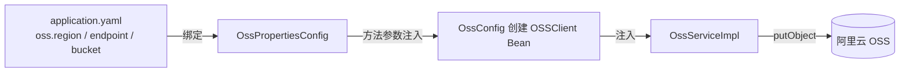

# Spring Boot 集成阿里云 OSS 上传

以 OSS Java SDK V2（`alibabacloud-oss-v2`）为例，实现把上传的文件传到阿里云 OSS，并返回可访问的链接。

## 一、添加依赖

在 `pom.xml` 中加入：

```xml
<dependency>
    <groupId>com.aliyun</groupId>
    <artifactId>alibabacloud-oss-v2</artifactId>
    <version>0.5.1</version>
</dependency>
```

注意：这是 OSS 的 V2 SDK，包名是 `com.aliyun.sdk.service.oss2`，和 V1 的 `com.aliyun.oss` 不是同一个库，API 也不一样（V2 基于 Builder 模式）。另外 V2 里 `OSSClient.putObject()` 是同步方法，直接返回 `PutObjectResult`，不需要 `.get()`。

## 二、application.yaml 配置

```yaml
oss:
  region: cn-beijing
  endpoint: oss-cn-beijing.aliyuncs.com
  bucket: ci-java-test
```

| 配置项 | 是否必填 | 说明 |
| ------ | -------- | ---- |
| `region` | ✅ 必填 | Bucket 所在地域，用于请求签名 |
| `endpoint` | 可选 | 访问域名，不填会用 region 对应的默认域名 |
| `bucket` | ✅ 必填 | Bucket 名称 |

> ⚠️ AccessKey ID / Secret 属于敏感信息，不要写进 yaml（尤其仓库会上 Git 的情况），用环境变量提供，见下文第六节。

## 三、核心：两个 config 文件

这是整个集成里最值得理解的两个类，放在 `src/main/java/com/cjy/config/` 包下。

### 1. OssPropertiesConfig —— 配置绑定类

```java
package com.cjy.config;

import org.springframework.boot.context.properties.ConfigurationProperties;

@ConfigurationProperties(prefix = "oss")
public record OssPropertiesConfig (String region, String endpoint, String bucket){
}
```

逐点讲解：

- `@ConfigurationProperties(prefix = "oss")`：告诉 Spring 把 yaml 里 `oss:` 开头的配置绑定到这个类。record 的字段名 `region` / `endpoint` / `bucket` 会和 yaml 里的 key 一一对应（支持驼峰 ↔ 中划线自动映射）。
- 为什么用 **record**：Spring Boot 3 原生支持 record 绑定，代码量最少，且天然不可变，不会有 setter 被意外修改。取值直接用 `props.region()` 这种访问器方法。
- 为什么不用 `@Value` 一个个取：`@ConfigurationProperties` 把所有配置集中在一个对象里，类型安全、便于校验和复用；配置项多了之后 `@Value` 会散落各处很难维护。
- **关键前提**：主启动类上必须加 `@ConfigurationPropertiesScan`，Spring 才会扫描并注册这个类：

  ```java
  @ConfigurationPropertiesScan
  @SpringBootApplication
  public class SpringbootQuickstartApplication {
      public static void main(String[] args) {
          SpringApplication.run(SpringbootQuickstartApplication.class, args);
      }
  }
  ```

  如果没加这个注解，`OssPropertiesConfig` 不会成为 Bean，注入时会报找不到类型的错误。

### 2. OssConfig —— 创建 OSSClient Bean

```java
package com.cjy.config;

import com.aliyun.sdk.service.oss2.OSSClient;
import com.aliyun.sdk.service.oss2.OSSClientBuilder;
import com.aliyun.sdk.service.oss2.credentials.EnvironmentVariableCredentialsProvider;
import org.springframework.context.annotation.Bean;
import org.springframework.context.annotation.Configuration;

@Configuration
public class OssConfig {
    @Bean(destroyMethod = "close")
    OSSClient ossClient(OssPropertiesConfig props) {
        OSSClientBuilder builder = OSSClient.newBuilder()
                .credentialsProvider(new EnvironmentVariableCredentialsProvider())
                .region(props.region());
        if (props.endpoint() != null && !props.endpoint().isBlank()) {
            builder.endpoint(props.endpoint());
        }
        return builder.build();
    }
}
```

逐点讲解：

- `@Configuration`：声明这是一个 Spring 配置类，里面的 `@Bean` 方法会被容器管理。
- `@Bean(destroyMethod = "close")`：把 `OSSClient` 注册为容器中的单例 Bean，并指定应用关闭时调用 `close()` 释放底层连接资源，防止连接泄漏。
- `ossClient(OssPropertiesConfig props)`：方法参数会自动注入上一步的配置 Bean，所以这里能直接拿到 `props.region()` 等值。这体现了两个 config 的分工：**OssPropertiesConfig 负责"配置从哪来"，OssConfig 负责"客户端怎么建"**。
- `OSSClient.newBuilder()`：V2 SDK 的建造者模式入口。
- `.credentialsProvider(new EnvironmentVariableCredentialsProvider())`：凭证从环境变量读取。⚠️ 这个 SDK 读的是 `OSS_ACCESS_KEY_ID` / `OSS_ACCESS_KEY_SECRET`，**不是** `ALIBABA_CLOUD_ACCESS_KEY_ID`（那是 V1 的命名），变量名搞错会报 `Credentials is null or empty`。
- `.region(...)`：必填，签名和默认域名都依赖它。
- endpoint 可选：有值才设置，方便以后接自定义 endpoint 或内网地址。
- 为什么放在 `config` 包而不是 `utils`：这是 Spring 配置类，负责装配 Bean；`utils` 一般只放静态工具方法，职责不同。

整个配置的数据流：



## 四、Service 层

接口：

```java
public interface OssService {
    String upload(MultipartFile file) throws IOException;
}
```

实现：

```java
@Slf4j
@Service
public class OssServiceImpl implements OssService {
    @Autowired
    private OSSClient ossClient;

    @Autowired
    private OssPropertiesConfig ossProperties;

    @Override
    public String upload(MultipartFile file) throws IOException {
        String originalFilename = file.getOriginalFilename();
        String suffix = (originalFilename == null || originalFilename.lastIndexOf(".") == -1)
                ? ""
                : originalFilename.substring(originalFilename.lastIndexOf("."));
        String datePath = LocalDate.now().format(DateTimeFormatter.ofPattern("yyyy/MM/dd"));
        String key = datePath + "/" + UUID.randomUUID() + suffix;

        PutObjectResult result = ossClient.putObject(PutObjectRequest.newBuilder()
                .bucket(ossProperties.bucket())
                .key(key)
                .body(BinaryData.fromBytes(file.getBytes()))
                .build());

        log.info("OSS 上传成功, key: {}, eTag: {}, requestId: {}",
                key, result.eTag(), result.requestId());

        String endpoint = ossProperties.endpoint();
        if (endpoint.contains("://")) {
            endpoint = endpoint.substring(endpoint.indexOf("://") + 3);
        }
        return "https://" + ossProperties.bucket() + "." + endpoint + "/" + key;
    }
}
```

要点：

- **key 的生成**：按 `年/月/日/UUID.后缀` 组织目录，比如 `2026/08/02/xxxx.png`，既避免文件名冲突，又方便按时间归档和排查。UUID 保证唯一性，后缀保留扩展名（浏览器才能正确识别类型）。
- **bucket / key / body 缺一不可**：只传 body 会报 `request.bucket is required`。
- `BinaryData.fromBytes(file.getBytes())`：上传文件的真实字节流，而不是写死的字符串。
- `PutObjectResult` 里有 `eTag()`、`requestId()`、`statusCode()`，但**没有链接**，链接需要自己拼。

## 五、Controller

```java
@PostMapping("/ossUpload")
public Result ossUpload(@RequestParam("file") MultipartFile file) throws IOException {
    String url = ossService.upload(file);
    return Result.success(url);
}
```

上传成功后响应的 `data` 字段就是文件链接。

## 六、环境变量与凭证

启动应用前必须配置：

```bash
export OSS_ACCESS_KEY_ID=你的AccessKeyId
export OSS_ACCESS_KEY_SECRET=你的AccessKeySecret
```

两个最容易踩的坑：

1. **变量名**：V2 SDK 只认 `OSS_ACCESS_KEY_ID` / `OSS_ACCESS_KEY_SECRET`，设置成别的名字（比如 `ALIBABA_CLOUD_*`）会报 `Credentials is null or empty`。
2. **进程拿不到变量**：IntelliJ IDEA 启动的应用**不会继承** `~/.zshrc` / `~/.bash_profile` 里的环境变量。在 IDE 里需要到 `Run` → `Edit Configurations...` → 启动项的 `Environment variables` 里手动加上；从终端启动则要在同一个已 export 的终端里重启。

## 七、常见报错排查

| 报错 | 原因 | 解决办法 |
| ---- | ---- | -------- |
| `request.bucket is required` | `PutObjectRequest` 没设置 bucket/key | 请求里补上 `.bucket(...)` 和 `.key(...)` |
| `Credentials is null or empty` | 进程环境里没有凭证，或变量名不对 | 按第六节检查变量名和启动方式 |
| `InvalidAccessKeyId` / `SignatureDoesNotMatch` | 密钥错误，或 region 与 bucket 地域不一致 | 核对密钥、确认 region 和 bucket 在同一地域 |
| `NoSuchBucket` | Bucket 不存在或名称拼错 | 去 OSS 控制台确认 Bucket 名称 |

## 八、拿到链接后的访问问题

默认拼出来的链接：

```
https://{bucket}.{endpoint}/{key}
```

例如：`https://ci-java-test.oss-cn-beijing.aliyuncs.com/xxxx.png`

这个链接只有 **Bucket 为公共读** 时才能直接打开。如果是私有 Bucket，需要用 SDK 生成带签名的临时链接：

```java
PresignResult presignResult = ossClient.presign(GetObjectRequest.newBuilder()
        .bucket(bucket)
        .key(key)
        .build());
String signedUrl = presignResult.url(); // 带签名、有有效期
```

如果配置了自定义域名（CDN / 备案域名），链接格式为 `https://你的域名/{key}`，不走 bucket.endpoint 的形式。
