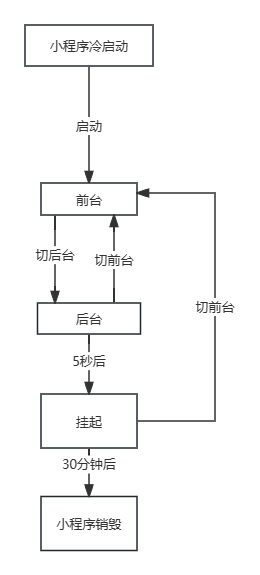

# 微信小程序运行机制

## 前台和后台状态

小程序启动后，界面被展示给用户，此时的小程序处于前台状态。

当用户关闭小程序时，小程序没有真正被关闭，而是进入了后台状态，当用户再次进入微信并打开小程序，小程序又会重新进入前台状态。

## 挂起

小程序进入后台状态一段时间后（5秒），微信停止小程序Js线程执行，小程序进入挂起状态，当开发者使用了后台播放音乐、后台地理位置等能力时，小程序可以在后台持续运行，不会进入挂起状态。

## 销毁

如果用户很久没有使用小程序，或者系统资源紧张，小程序会被销毁，即完全终止运行。

# 生命周期

## 应用生命周期

应用生命周期通常是指一个小程序从启动 -> 运行 ->销毁的整个过程。

应用生命周期函数需要在app.js文件的App()方法中进行定义，应用生命周期函数由onLaunch、onShow、onHide三个函数组成。

从小程序生命周期来看，启动专指冷启动，热启动一般被称为后台切前台。

## 页面生命周期

页面生命周期就是指小程序页面从加载 -> 运行 -> 销毁的整个过程。

